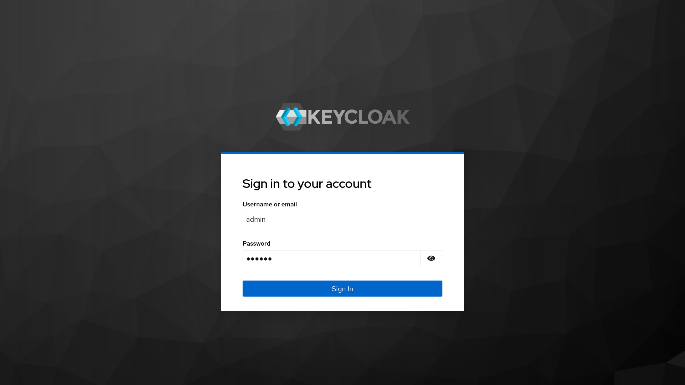
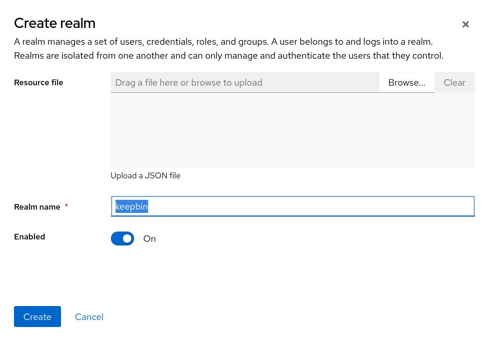
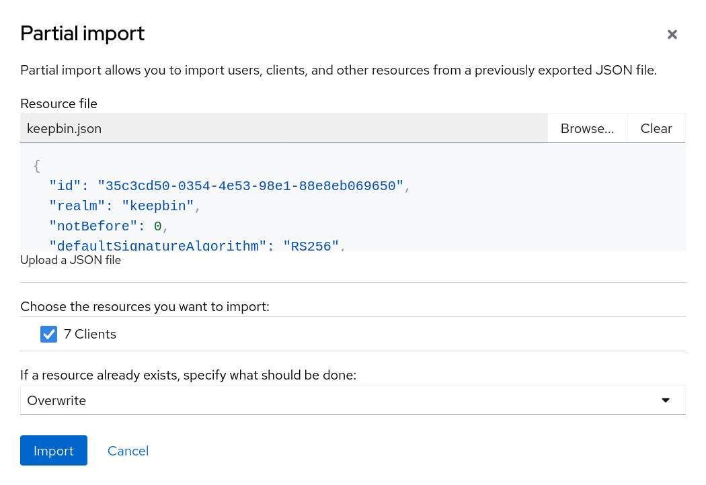
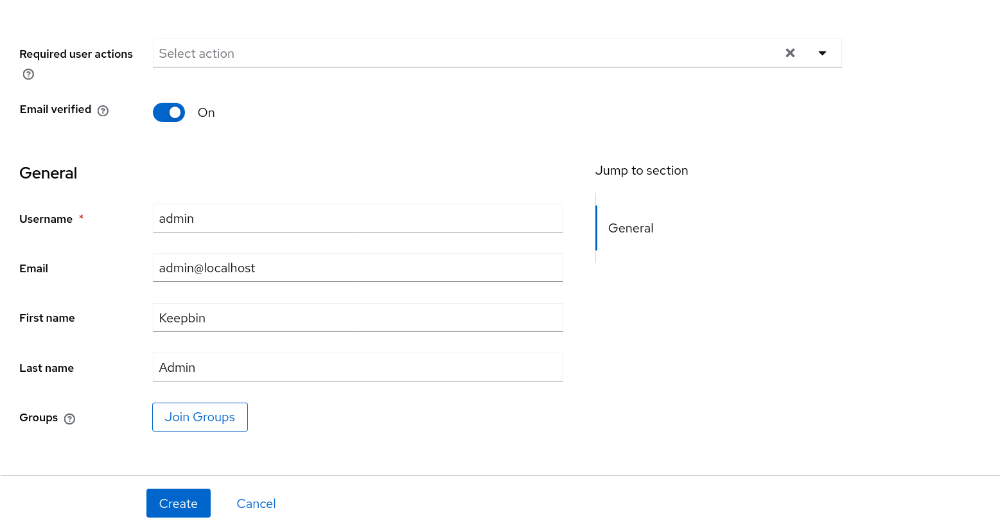
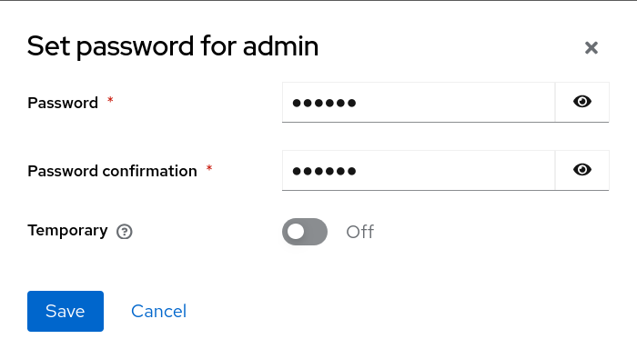

<h1 align="center">
  
  <br />
  KeepBin
</h1>

# Hướng dẫn thiết lập

> [!NOTE]
> Các lệnh trong hướng dẫn này cụ thể dành cho **Linux**. Ứng dụng chỉ yêu cầu **Docker Engine** hỗ trợ **Docker Compose**.

1. Tinh chỉ biến môi trường `.env` dựa theo mẫu tại `.env.template`:

| Tên | Mô tả | Ví dụ |
| --- | --- | --- |
| `LE_EMAIL` | Email để kiểm thử Let's Encrypt. **Hiện tại ứng dụng sử dụng chứng chỉ tự cấp nên dòng này không có tác dụng.** | `<địa chỉ>@<tên miền>.<tld>` |
| `DOCKER_SOCKET` | Đường dẫn chỉ tới socket. Nếu sử dụng Docker đặt là `/var/run/docker.sock`. | `/var/run/docker.sock` |
| `PROXY_DOMAIN` | Tên miền cho Traefik reverse-proxy (không kèm protocol v.d. `https://`). Nếu chạy local đặt là `localhost`. | `<tên miền>.<tld>`
| `DB_PASS` | Mật khẩu cho CSDL PostgreSQL (nên sử dụng mật khẩu mạnh). | &mdash; |
| `BACKEND_SESSION_SECRET` | Mật khẩu để backend lưu trữ session (nên sử dụng mật khẩu mạnh). | &mdash; |
| `OID_CLIENT_SECRET` | Mật khẩu của Keycloak client (có thể tự đặt rồi sửa lại, hoặc sao chép trong Keycloak Admin UI). | &mdash; |
| `S3_ACCESS_KEY_SECRET` | Mật khẩu cho lưu trữ SeaweedFS (nên sử dụng mật khẩu mạnh). | &mdash; |
| `KC_ADMIN_USER` | Tên người dùng cho Keycloak Admin UI. | `admin` |
| `KC_ADMIN_PASS` | Mật khẩu cho Keycloak Admin UI (nên sử dụng mật khẩu mạnh). | &mdash; |
| `SEAWEEDFS_ADMIN_USER` | Tên người dùng cho SeaweedFS Admin UI. | `admin` |
| `SEAWEEDFS_ADMIN_PASS` | Mật khẩu cho SeaweedFS Admin UI (nên sử dụng mật khẩu mạnh). | &mdash; |

2. Tạo chứng chỉ tạm thời cho Traefik:

```bash
mkdir -p proxy/certs
openssl req -x509 -nodes -days 365 -newkey rsa:2048 \
  -keyout proxy/certs/local.key -out proxy/certs/local.crt \
  -subj "/CN=*.<thay bằng tên miền `PROXY_DOMAIN`>"
```

3. Sau đó tạo cấu hình dynamic và TLS:

```bash
mkdir -p proxy/dynamic
cat > proxy/dynamic/tls.yml << EOF
tls:
  certificates:
    - certFile: /certs/local.crt
      keyFile: /certs/local.key
EOF
```

4. Chạy các container:

```bash
docker compose up -d
```

5. Truy cập Keycloak Admin UI tại đường dẫn `https://auth.<tên miền>` (v.d. `https://auth.localhost`) và đăng nhập:



6. Tạo một realm mới với tên là `keepbin`:



7. Tại tab "Realm settings", lựa chọn "Action" &rarr; "Partial import", chọn tệp tin `keepbin.json` trong thư mục `auth/realm-exports`. Chọn import tất cả client, và chọn "Overwrite" để ghi đè lên cấu hình cũ:



8. Tại tab "Users", tạo một người dùng mới, và cung cấp thông tin bất kỳ:



9. Với người dùng mới tạo, chọn tab "Credentials" và tạo mật khẩu đăng nhập:


